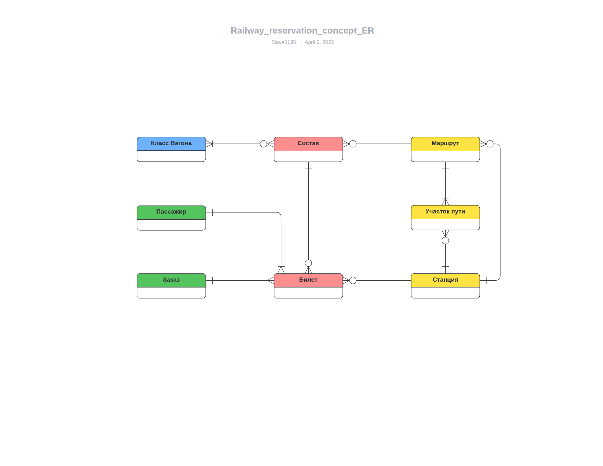
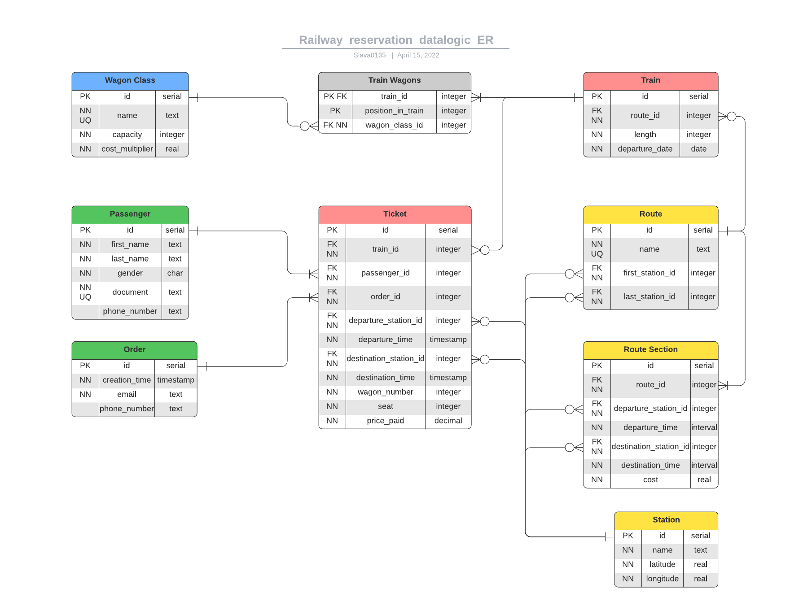

# Отчет по лабораторной работе №1

## Цель

Познакомиться с основами проектирования схемы БД, способами организации данных в SQL-БД.

## Программа работы

1. Создание проекта для работы в GitLab.
2. Выбор задания (предметной области), описание набора данных и требований к хранимым данным в свободном формате в wiki своего проекта в GitLab.
3. Формирование в свободном формате (предпочтительно в виде графической схемы) cхемы БД, соответствующей заданию. Должно получиться не менее 7 таблиц.
4. Согласование с преподавателем схемы БД. Обоснование принятых решений и соответствия требованиям выбранного задания.
5. Выкладывание схемы БД в свой проект в GitLab.
6. Демонстрация результатов преподавателю.

## Ход работы

В качестве предметной области я выбрал Железнодорожную Систему Бронирования, где необходимо хранить следующие данные:

* Список составов (номер маршрута, день отправления, количество и типы вагонов).
* Типы вагонов - люкс/купе/плацкарт/сидячий (количество мест, множитель стоимости)
* Список маршрутов (номер, начальная станция, конечная станция).
* Список участков пути (номер маршрута, текущая станция и время отправления, следующая станция и время прибытия, стоимость на место).
* Список заказов (дата оформления, билеты, контакты заказа - электронная почта и номер телефона).
  * Один человек может оформить билеты на нескольких пассажиров.
* Список билетов (номер состава/маршрута, данные пассажира, станция и время назначения/отправления, тип и номер вагона, посадочное место, номер заказа, стоимость билета).
* Данные пассажиров (ФИО, пол, номер документа, номер телефона).
  * На одного пассажира может быть оформлено несколько билетов (можно выкупить несколько мест для удобства).

Я создал следующую концептуальную схему:

На ее основе я построил даталогическую модель БД:

## Выводы

В ходе выполнения данной лабораторной работы я научился строить схему БД в соответствии с заданием.
